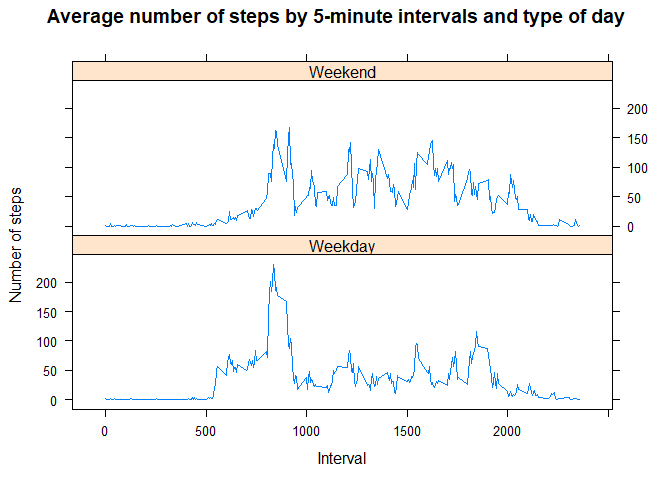

## Loading and preprocessing the data
Let's download and unzip the activity.zip file (if necessery).

```r
zip_file <- "activity.zip"

if (!file.exists(zip_file)){
        zip_file_URL <- "https://d396qusza40orc.cloudfront.net/repdata%2Fdata%2Factivity.zip"
        download.file(zip_file_URL, zip_file)
}

if (!file.exists("activity.csv")){
        unzip(zip_file)
}
```

Let's read the data and take a look on it.

```r
act_data <- read.csv("activity.csv")
head(act_data)
```

```
##   steps       date interval
## 1    NA 2012-10-01        0
## 2    NA 2012-10-01        5
## 3    NA 2012-10-01       10
## 4    NA 2012-10-01       15
## 5    NA 2012-10-01       20
## 6    NA 2012-10-01       25
```

```r
summary(act_data)
```

```
##      steps                date          interval     
##  Min.   :  0.00   2012-10-01:  288   Min.   :   0.0  
##  1st Qu.:  0.00   2012-10-02:  288   1st Qu.: 588.8  
##  Median :  0.00   2012-10-03:  288   Median :1177.5  
##  Mean   : 37.38   2012-10-04:  288   Mean   :1177.5  
##  3rd Qu.: 12.00   2012-10-05:  288   3rd Qu.:1766.2  
##  Max.   :806.00   2012-10-06:  288   Max.   :2355.0  
##  NA's   :2304     (Other)   :15840
```
The first column shows us number of steps taking in a 5-minute interval (and contains NA-values). The second column - the date on which the measurement was taken in YYYY-MM-DD format. And the third column - identifier for the 5-minute interval in which measurement was taken.

## What is mean total number of steps taken per day?
Let's create data frame with the total number of steps taken per day and take a look on it.

```r
steps_per_day <- aggregate(steps ~ date, data = act_data, sum)
head(steps_per_day)
```

```
##         date steps
## 1 2012-10-02   126
## 2 2012-10-03 11352
## 3 2012-10-04 12116
## 4 2012-10-05 13294
## 5 2012-10-06 15420
## 6 2012-10-07 11015
```
Histogram of the total steps:

```r
hist(steps_per_day$steps, breaks=20, xlab="Number of steps", main="Total number of steps taken each day")
```

<!-- -->

Mean number of steps (using "floor" here means the number of steps is a whole number):

```r
floor(mean(steps_per_day$steps))
```

```
## [1] 10766
```

Median number of steps:

```r
floor(median(steps_per_day$steps))
```

```
## [1] 10765
```


## What is the average daily activity pattern?
Let's create data frame with the average number of steps taken per each 5-minute interval and take a look on it.

```r
steps_per_int <- aggregate(steps ~ interval, data=act_data, mean)
steps_per_int$steps <- floor(steps_per_int$steps)
head(steps_per_int)
```

```
##   interval steps
## 1        0     1
## 2        5     0
## 3       10     0
## 4       15     0
## 5       20     0
## 6       25     2
```

Plot of the 5-minute interval and the average number of steps taken, averaged across all days:


```r
plot(steps_per_int$interval, steps_per_int$steps, type='l', xlab="Interval", ylab="Average number of steps", main="Average number of steps by interval")
grid()
```

<!-- -->

Maximum average number of steps by interval:


```r
max_steps <- max(steps_per_int$steps)
max_steps
```

```
## [1] 206
```

And relevant interval:

```r
max_steps_int <- steps_per_int[which.max(steps_per_int$steps), 1]
max_steps_int
```

```
## [1] 835
```


## Imputing missing values

Let's find all missing values in the dataset. Let's check every column for NA's.

"Steps" column:


```r
steps_NA <- sum(is.na(act_data$steps))
steps_NA
```

```
## [1] 2304
```

"Date" column:


```r
date_NA <- sum(is.na(act_data$date))
date_NA
```

```
## [1] 0
```

"Interval" column:


```r
interval_NA <- sum(is.na(act_data$interval))
interval_NA
```

```
## [1] 0
```

Fortunately, we have missing values only in one column - steps. Total number of missing values is 2304.

Let's replace missing values using means of relevant 5-minutes intervals.


```r
upd_data <- act_data
ind <- which(is.na(act_data$steps))
for (i in ind){
    upd_data[i, ]$steps <- steps_per_int[which(steps_per_int$interval == upd_data[i, ]$interval), ]$steps
}
```

Let's make sure that we have replaced all missing values.


```r
sum(!complete.cases(upd_data))
```

```
## [1] 0
```

Histogram of the total steps:


```r
steps_per_day_upd <- aggregate(steps ~ date, data = upd_data, sum)

c1 <- rgb(173,216,230,max = 255, alpha = 80, names = "lt.blue")
c2 <- rgb(255,192,203, max = 255, alpha = 80, names = "lt.pink")

br_min <- min(steps_per_day_upd$steps)
br_max <- max(steps_per_day_upd$steps)
br <- pretty(br_min:br_max, n = 20)

hg1 <- hist(steps_per_day_upd$steps, breaks=br, col=c1, main="Total number of steps taken each day", xlab="Number of steps")
hg2 <- hist(steps_per_day$steps, breaks=br, col=c2, add=TRUE, legend=c("NA replaced by mean", "NA omitted"))
legend("topright", legend=c("NA replaced by means","NA omitted"), col=c(c1, c2), pt.cex=2, pch=15 )
```

<!-- -->

Mean number of steps:

```r
floor(mean(steps_per_day_upd$steps))
```

```
## [1] 10749
```

Median number of steps:

```r
floor(median(steps_per_day_upd$steps))
```

```
## [1] 10641
```

Replacing missing values using means of 5-minutes intervals has led to a decreasing of mean and median values.

## Are there differences in activity patterns between weekdays and weekends?

For the first, let's set the local time to correct format. It's necessery if we want to get weekdays in English.
Secondary, let's replace the date by weekdays.
Finally, let's replace weekdays by factor variable: weekday or weekend.


```r
Sys.setlocale("LC_TIME","English")
```

```
## [1] "English_United States.1252"
```

```r
upd_data$day_type <- weekdays(as.Date(upd_data$date))
upd_data$day_type <- as.factor(ifelse(upd_data$day_type %in% c("Saturday", "Sunday"), "Weekend", "Weekday"))
```

Let's create data frame with the average number of steps taken per each 5-minute interval based on type of the day. And let's look at the plot.


```r
steps_per_day_int <- aggregate(steps ~ interval + day_type, upd_data, mean)
library(lattice)
```

```
## Warning: package 'lattice' was built under R version 3.6.3
```

```r
xyplot(steps ~ interval|day_type, data=steps_per_day_int, main="Average number of steps by 5-minute intervals and type of day", xlab="Interval", ylab="Number of steps", layout=c(1, 2), type="l")
```

<!-- -->


